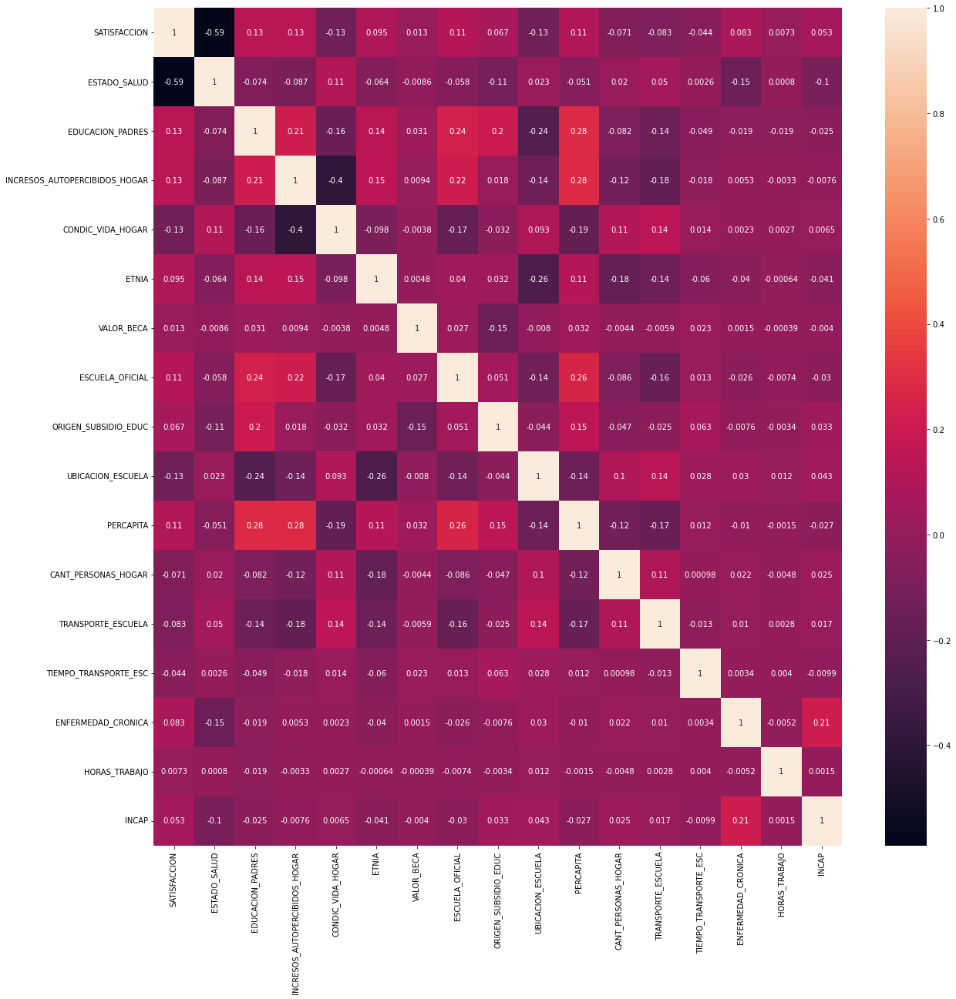
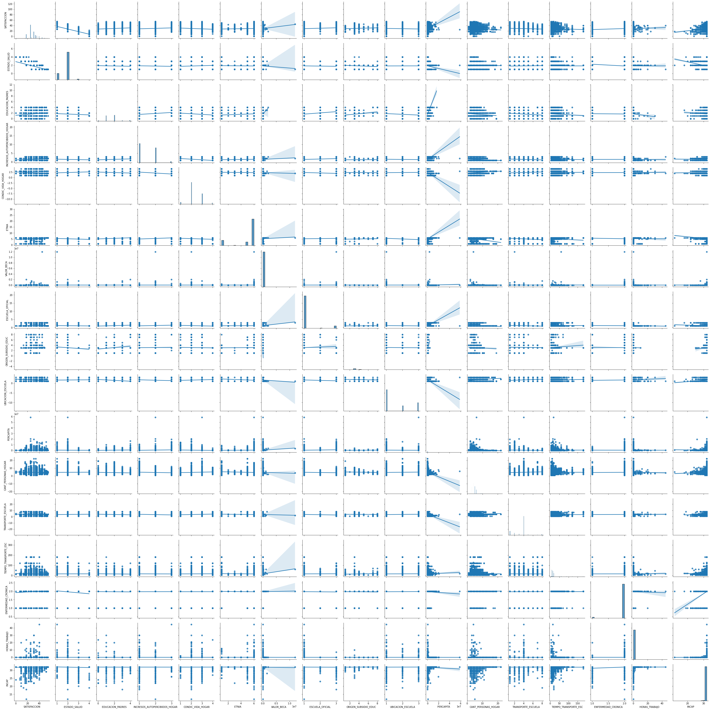

```python
# from google.colab import drive
# drive.mount('/content/drive')
```

    Mounted at /content/drive


##Dependencias del proyecto


```python
import pandas as pd
import numpy as np
import matplotlib.pyplot as plt
import seaborn as sns
```

Los datos estaban almacenados en una unidad compartidad de Drive por lo que los datos se importaron desde ahí. Si se desea correr, entonces cambie esta ubicación.


```python
# ruta_datos = '/content/drive/Shareddrives/TAE/Entregas/1/Datos/Encuesta/'
ruta_datos = 'daten/'
# ruta_destino_datos = '/content/drive/Shareddrives/TAE/Entregas/1/Datos/Exportados/'
ruta_destino_datos = 'daten/'
```

### Funciones helpers


```python
def crear_id_persona(dataFrame):
  dataFrame['ID_Persona'] = (dataFrame['DIRECTORIO'].astype(str) + 
                           dataFrame['SECUENCIA_ENCUESTA'].astype(str) + 
                           dataFrame['SECUENCIA_P'].astype(str)).astype(int)
  return dataFrame

def crear_id_hogar(dataFrame):
  dataFrame['ID_Hogar'] = (dataFrame['DIRECTORIO'].astype(str) + 
                         dataFrame['SECUENCIA_P'].astype(str)).astype(int)
  return dataFrame
```

## Lectura de las bases de datos

### Características y composición del hogar


```python
df_car_hogar = pd.read_csv(ruta_datos + 'Características y composición del hogar.csv', sep=';')

#Reemplazar espacios por null
df_car_hogar = df_car_hogar.replace(' ',np.nan)

# Clasificar los ninos entre 6 y 12 años
df_car_hogar['Clasificación'] = df_car_hogar['P6040'].apply(lambda edad: 'nino' 
                                                            if edad <= 12 and edad > 5  else 'otro')

# Generar un ID Persona
df_car_hogar = crear_id_persona(df_car_hogar)

# Generar un ID Hogar para conoces a qué hogar pertenece cada persona
df_car_hogar = crear_id_hogar(df_car_hogar)

# Eliminar los datos que no pertenecen a niños
indx_otro = df_car_hogar[df_car_hogar['Clasificación']=='otro'].index
df_car_hogar=df_car_hogar.drop(indx_otro)

# Renombrar las variables que usaremos
df_car_hogar.rename(columns={'P6040':'EDAD', 'P6080':'ETNIA', 'P6081':'VIVE_CON_PADRE',
                    'P6083':'VIVE_CON_MADRE', 'P6087':'EDUCACION_PADRE', 
                    'P6088':'EDUCACION_MADRE'}, inplace=True)

df_car_hogar = df_car_hogar.astype({'EDUCACION_MADRE':float, 'EDUCACION_PADRE':float})
```

Las variables de 'EDUCACION_MADRE' y 'EDUCACION_PADRE' las resumiremos como sigue:

0. Ninguna
1. Primaria
2. Secundaria
3. Técnica o Tecnología
4. Universidad


```python
for column in ['EDUCACION_PADRE', 'EDUCACION_MADRE']:
    df_car_hogar[column].replace(2.0, 1.0, inplace=True)
    df_car_hogar[column].replace(3.0, 2.0, inplace=True)
    df_car_hogar[column].replace(4, 2.0, inplace = True)
    df_car_hogar[column].replace(5.0, 3.0, inplace=True)
    df_car_hogar[column].replace(6, 3.0, inplace = True)
    df_car_hogar[column].replace(7.0, 4.0, inplace = True)
    df_car_hogar[column].replace(8.0, 4.0, inplace = True)
    df_car_hogar[column].replace(9.0, 0.0, inplace = True)
    df_car_hogar[column].replace(np.nan, -1.0, inplace = True)
    df_car_hogar[column].replace(10.0, -1, inplace = True)

```

Generamos la variable de 'EDUCACION_PADRES' como el máximo entre 'EDUCACION_MADRE' y 'EDUCACION_PADRE'


```python
df_car_hogar['EDUCACION_PADRES'] = df_car_hogar[['EDUCACION_PADRE', 'EDUCACION_MADRE']].max(axis=1)

df_car_hogar.loc[df_car_hogar['EDUCACION_PADRES'] == -1.0, 'EDUCACION_PADRES'] = np.nan
```


```python
# Sacar las variables que se van a usar posteriormente
df_car_hogar = df_car_hogar[['ID_Hogar', 'ID_Persona', 'EDAD', 'ETNIA', 'VIVE_CON_PADRE', 
                             'VIVE_CON_MADRE', 'EDUCACION_PADRES']]
```

### Educación


```python
df_educacion  = pd.read_csv(ruta_datos + 'Educación.csv', sep=';')

df_educacion = df_educacion.replace(' ',np.nan)

# conbinacion escuela oficial con inoficial con y sin substito
df_educacion.update(df_educacion.P5674.replace('2', '3').replace('1', '2').rename('P5673'), overwrite=True)

# anadir 0 para el valor de beca para todos que no tienen beca.
df_educacion.update(df_educacion.P8610.replace('2', 1).rename('P8610S1'), overwrite=False)

df_educacion = crear_id_persona(df_educacion)

df_educacion.rename(columns={'P5673':'ESCUELA_OFICIAL', 'P6223':'UBICACION_ESCUELA', 
                             'P6238':'ORIGEN_SUBSIDIO_EDUC', 'P8586':'ESTUDIA', 
                             'P8610S1':'VALOR_BECA', 'P4693':'TRANSPORTE_ESCUELA',
                             'P6167':'TIEMPO_TRANSPORTE_ESC', 'P782':'EDAD_CUIDADOR', 
                             'P3004S1':'ACT1', 'P3004S2':'ACT2', 'P3004S3':'ACT3', 
                             'P3004S4':'ACT4','P3004S5':'ACT5', 'P3004S6':'ACT6',
                             'P3004S7':'ACT7', 'P3004S8':'NO_ACT'}, inplace=True)

df_educacion = df_educacion[['ID_Persona', 'ESCUELA_OFICIAL', 'UBICACION_ESCUELA', 
                             'ORIGEN_SUBSIDIO_EDUC', 'ESTUDIA', 'VALOR_BECA',
                             'TRANSPORTE_ESCUELA', 'TIEMPO_TRANSPORTE_ESC', 'EDAD_CUIDADOR',
                             'ACT1', 'ACT2', 'ACT3','ACT4', 'ACT5', 'ACT6', 'ACT7',
                             'NO_ACT']]
```

### Salud


```python
df_salud = pd.read_csv(ruta_datos + 'Salud.csv', sep=';')

df_salud = df_salud.replace(' ',np.nan)

df_salud['P6090'].replace(9, np.nan, inplace=True)

df_salud = crear_id_persona(df_salud)

df_salud.rename(columns={'P6090':'AFILIADO_SALUD', 'P6127':'ESTADO_SALUD', 'P1930':'ENFERMEDAD_CRONICA'}, inplace=True)

# Crear la variable incap - la suma de las gravedades de las incapacidades (8 - incapacido; 32 - no tiene incapacidades)
df_salud['INCAP'] = df_salud[['P1906S1', 'P1906S2', 'P1906S3', 'P1906S4', 
                              'P1906S5', 'P1906S6', 'P1906S7', 'P1906S8']].sum(axis=1, min_count=8)

df_salud = df_salud[['ID_Persona', 'AFILIADO_SALUD', 'ESTADO_SALUD', 'ENFERMEDAD_CRONICA',
                     'INCAP']]
```

    /tmp/ipykernel_331/4020623098.py:2: PerformanceWarning: DataFrame is highly fragmented.  This is usually the result of calling `frame.insert` many times, which has poor performance.  Consider joining all columns at once using pd.concat(axis=1) instead.  To get a de-fragmented frame, use `newframe = frame.copy()`
      dataFrame['ID_Persona'] = (dataFrame['DIRECTORIO'].astype(str) +


### Trabajo infantil


```python
df_trabajo = pd.read_csv(ruta_datos + 'Trabajo infantil.csv', sep=';')

df_trabajo = df_trabajo.replace(' ',np.nan)

df_trabajo = crear_id_persona(df_trabajo)

# TRABAJO1, TRABAJO2, TRABAJO3 hacen referencia a preguntas relacionadas a trabajos
# durante la últimas semanas
df_trabajo.rename(columns={'P171':'HORAS_TRABAJO', 'P400':'ACTIVIDAD_ULT_SEMANA', 
                          'P401':'TRABAJO1', 'P402':'TRABAJO2', 'P403':'TRABAJO3',
                          'P404':'TRABAJO4', 'P420':'LUGAR_TRABAJO'}, inplace=True)

df_trabajo = df_trabajo[['ID_Persona', 'HORAS_TRABAJO', 'ACTIVIDAD_ULT_SEMANA', 
                         'TRABAJO1', 'TRABAJO2', 'TRABAJO3', 'TRABAJO4', 'LUGAR_TRABAJO']]
```

    /opt/conda/lib/python3.9/site-packages/IPython/core/interactiveshell.py:3457: DtypeWarning: Columns (5) have mixed types.Specify dtype option on import or set low_memory=False.
      exec(code_obj, self.user_global_ns, self.user_ns)


### Servicios del hogar


```python
df_serv_hogar = pd.read_csv(ruta_datos + 'Servicios del hogar.csv', sep=';')

df_serv_hogar = df_serv_hogar .replace(' ',np.nan)

df_serv_hogar = crear_id_hogar(df_serv_hogar)

df_serv_hogar  = df_serv_hogar [['ID_Hogar', 'PERCAPITA', 'CANT_PERSONAS_HOGAR']]
```

### Condiciones de vida del hogar y tenencia de bienes


```python
df_cond_hogar = pd.read_csv(ruta_datos + 'Condiciones de vida del hogar y tenencia de bienes.csv', sep=';')

df_cond_hogar = df_cond_hogar.replace(' ',np.nan)

df_cond_hogar = crear_id_hogar(df_cond_hogar)

df_cond_hogar.rename(columns={'P9090':'INCRESOS_AUTOPERCIBIDOS_HOGAR', 
                             'P9030':'CONDIC_VIDA_HOGAR'}, inplace=True)
                             
df_cond_hogar = df_cond_hogar[['ID_Hogar', 'INCRESOS_AUTOPERCIBIDOS_HOGAR', 
                               'CONDIC_VIDA_HOGAR']]
```

    /opt/conda/lib/python3.9/site-packages/IPython/core/interactiveshell.py:3457: DtypeWarning: Columns (29) have mixed types.Specify dtype option on import or set low_memory=False.
      exec(code_obj, self.user_global_ns, self.user_ns)


## Construcción del dataframe general


```python
df = df_car_hogar.merge(df_educacion, how='left', on='ID_Persona')

df = df.merge(df_salud, how='left', on='ID_Persona')

df = df.merge(df_trabajo, how='left', on='ID_Persona')

df = df.merge(df_serv_hogar, how='left', on='ID_Hogar')

df = df.merge(df_cond_hogar, how='left', on='ID_Hogar')
```


```python
# Crear la varible actividades que tiene el número de las diferentes actividedas que hacen.
p3004 = df[['ACT1', 'ACT2', 'ACT3', 'ACT4', 'ACT5', 'ACT6', 'ACT7',]].astype(float)

df['ACTIVIDADES'] = p3004.sum(axis=1, min_count=1)

df.update((df['NO_ACT'].astype(float)%1).rename('ACTIVIDADES'), overwrite=False)
```


```python
# Anadir cero horas trabajando para los que no trabajan
no_trabaja = ((df['ACTIVIDAD_ULT_SEMANA'].astype(float)>1) * (df['TRABAJO1'].astype(float)!=1) * 
              (df['TRABAJO2'].astype(float)!=1) * (df['TRABAJO3'].astype(float)!=1))

df.update((no_trabaja.replace(False, np.nan)%1).rename('HORAS_TRABAJO'), overwrite=False)

df1 = df['ACTIVIDAD_ULT_SEMANA'].astype(str).str.get_dummies()
df1.loc[df1.nan==1, '1.0'] = np.nan

df.TRABAJO1.replace('2', 0, inplace=True)
df.TRABAJO2.replace('2', 0, inplace=True)
df.TRABAJO3.replace('2', 0, inplace=True)

df['TRABAJA'] = (df1['1.0'] + df['TRABAJO1'].replace(np.nan, 0).astype(int) + 
                df['TRABAJO2'].replace(np.nan, 0).astype(int) + 
                df['TRABAJO3'].replace(np.nan, 0).astype(int))

df.update(df['TRABAJA'].replace(1.0, np.nan).replace(0.0,'0').rename('LUGAR_TRABAJO'), overwrite=False)
```


```python
df['PERCAPITA'] = df['PERCAPITA'].astype(str).apply(lambda x: x.replace(',','.'))
```


```python
df = df.astype({'ESTUDIA':float, 'ESTADO_SALUD':float, 'ETNIA':float, 
                'PERCAPITA':float, 'INCRESOS_AUTOPERCIBIDOS_HOGAR':float, 
                'CONDIC_VIDA_HOGAR':float})
```

## Cálculo de la variable de satisfacción:


Usamos los siguientes dos variable:
 - Salud - P6127: Estado de salud del niño
 - Educación - P3004: Número de las actividades realiza fuera de la jornada escolar.
Decimos que el óptimo es participar en todas las actividades y tener un estado de salud 1 ("muy bueno").
Asímismo decimos que el peor de los casos es que el niño no practique ninguna actividad y su estado se salud sea 4 ("malo").

Primero poderamos la variable "Actividades" con la fórmula de Gauß. Así, la diverencia entre realizar 6 o 7 actividades no es tan grande como la diferencia entre realizar 1 o ninguna actividad.


```python
lfunc = np.vectorize(lambda n: n*8 -((n+1)*n/2))

df['Actividades_p'] = lfunc(df['ACTIVIDADES'])
```

Ahora queremos sumar las dos variables. Por eso relacionamos los valores de salud al mismo tamaño.


```python
lfunc = np.vectorize(lambda n: n*(-9) + 36)

df['Salud_p'] = lfunc(df['ESTADO_SALUD'])
```

Y las sumamos:


```python
df['SATISFACCION'] = df[['Salud_p', 'Actividades_p']].sum(axis=1, skipna=False).astype(float)
```


```python
# Se borran los datos que contengan NaN en satisfaccion, puesto que no podemos usarlos para entrenar
df.drop(df[df.SATISFACCION.isna()].index, inplace=True)
```

## Mostrar correlaciones


```python
df_vars = df[['SATISFACCION', 'ESTADO_SALUD', 'EDUCACION_PADRES', 'INCRESOS_AUTOPERCIBIDOS_HOGAR', 
              'CONDIC_VIDA_HOGAR', 'ETNIA', 'VALOR_BECA', 'ESCUELA_OFICIAL',
              'ORIGEN_SUBSIDIO_EDUC', 'UBICACION_ESCUELA', 'PERCAPITA', 'CANT_PERSONAS_HOGAR',
              'TRANSPORTE_ESCUELA', 'TIEMPO_TRANSPORTE_ESC', 'ENFERMEDAD_CRONICA', 'HORAS_TRABAJO',
              'INCAP']].astype(float)
df_corr = df_vars.corr()
df_corr
```


<div>
<style scoped>
    .dataframe tbody tr th:only-of-type {
        vertical-align: middle;
    }

    .dataframe tbody tr th {
        vertical-align: top;
    }

    .dataframe thead th {
        text-align: right;
    }
</style>
<table border="1" class="dataframe">
  <thead>
    <tr style="text-align: right;">
      <th></th>
      <th>SATISFACCION</th>
      <th>ESTADO_SALUD</th>
      <th>EDUCACION_PADRES</th>
      <th>INCRESOS_AUTOPERCIBIDOS_HOGAR</th>
      <th>CONDIC_VIDA_HOGAR</th>
      <th>ETNIA</th>
      <th>VALOR_BECA</th>
      <th>ESCUELA_OFICIAL</th>
      <th>ORIGEN_SUBSIDIO_EDUC</th>
      <th>UBICACION_ESCUELA</th>
      <th>PERCAPITA</th>
      <th>CANT_PERSONAS_HOGAR</th>
      <th>TRANSPORTE_ESCUELA</th>
      <th>TIEMPO_TRANSPORTE_ESC</th>
      <th>ENFERMEDAD_CRONICA</th>
      <th>HORAS_TRABAJO</th>
      <th>INCAP</th>
    </tr>
  </thead>
  <tbody>
    <tr>
      <th>SATISFACCION</th>
      <td>1.000000</td>
      <td>-0.590376</td>
      <td>0.134505</td>
      <td>0.133371</td>
      <td>-0.125947</td>
      <td>0.095033</td>
      <td>0.012904</td>
      <td>0.113721</td>
      <td>0.067439</td>
      <td>-0.128320</td>
      <td>0.106891</td>
      <td>-0.071066</td>
      <td>-0.082573</td>
      <td>-0.044358</td>
      <td>0.083471</td>
      <td>0.007275</td>
      <td>0.052805</td>
    </tr>
    <tr>
      <th>ESTADO_SALUD</th>
      <td>-0.590376</td>
      <td>1.000000</td>
      <td>-0.073525</td>
      <td>-0.087442</td>
      <td>0.107567</td>
      <td>-0.063701</td>
      <td>-0.008629</td>
      <td>-0.057992</td>
      <td>-0.108287</td>
      <td>0.023207</td>
      <td>-0.051138</td>
      <td>0.019881</td>
      <td>0.050367</td>
      <td>0.002550</td>
      <td>-0.152961</td>
      <td>0.000805</td>
      <td>-0.103084</td>
    </tr>
    <tr>
      <th>EDUCACION_PADRES</th>
      <td>0.134505</td>
      <td>-0.073525</td>
      <td>1.000000</td>
      <td>0.212084</td>
      <td>-0.157969</td>
      <td>0.138331</td>
      <td>0.030688</td>
      <td>0.237470</td>
      <td>0.203283</td>
      <td>-0.240262</td>
      <td>0.284548</td>
      <td>-0.081730</td>
      <td>-0.142056</td>
      <td>-0.049013</td>
      <td>-0.019444</td>
      <td>-0.019359</td>
      <td>-0.025211</td>
    </tr>
    <tr>
      <th>INCRESOS_AUTOPERCIBIDOS_HOGAR</th>
      <td>0.133371</td>
      <td>-0.087442</td>
      <td>0.212084</td>
      <td>1.000000</td>
      <td>-0.395149</td>
      <td>0.147911</td>
      <td>0.009444</td>
      <td>0.216280</td>
      <td>0.017945</td>
      <td>-0.141383</td>
      <td>0.279562</td>
      <td>-0.119945</td>
      <td>-0.181675</td>
      <td>-0.018490</td>
      <td>0.005328</td>
      <td>-0.003297</td>
      <td>-0.007551</td>
    </tr>
    <tr>
      <th>CONDIC_VIDA_HOGAR</th>
      <td>-0.125947</td>
      <td>0.107567</td>
      <td>-0.157969</td>
      <td>-0.395149</td>
      <td>1.000000</td>
      <td>-0.098171</td>
      <td>-0.003773</td>
      <td>-0.170949</td>
      <td>-0.031533</td>
      <td>0.093110</td>
      <td>-0.185826</td>
      <td>0.106167</td>
      <td>0.144829</td>
      <td>0.014427</td>
      <td>0.002264</td>
      <td>0.002729</td>
      <td>0.006535</td>
    </tr>
    <tr>
      <th>ETNIA</th>
      <td>0.095033</td>
      <td>-0.063701</td>
      <td>0.138331</td>
      <td>0.147911</td>
      <td>-0.098171</td>
      <td>1.000000</td>
      <td>0.004775</td>
      <td>0.040216</td>
      <td>0.032294</td>
      <td>-0.262383</td>
      <td>0.112660</td>
      <td>-0.176521</td>
      <td>-0.137214</td>
      <td>-0.059510</td>
      <td>-0.040189</td>
      <td>-0.000640</td>
      <td>-0.041035</td>
    </tr>
    <tr>
      <th>VALOR_BECA</th>
      <td>0.012904</td>
      <td>-0.008629</td>
      <td>0.030688</td>
      <td>0.009444</td>
      <td>-0.003773</td>
      <td>0.004775</td>
      <td>1.000000</td>
      <td>0.026836</td>
      <td>-0.149750</td>
      <td>-0.008001</td>
      <td>0.031618</td>
      <td>-0.004370</td>
      <td>-0.005935</td>
      <td>0.023057</td>
      <td>0.001454</td>
      <td>-0.000387</td>
      <td>-0.003963</td>
    </tr>
    <tr>
      <th>ESCUELA_OFICIAL</th>
      <td>0.113721</td>
      <td>-0.057992</td>
      <td>0.237470</td>
      <td>0.216280</td>
      <td>-0.170949</td>
      <td>0.040216</td>
      <td>0.026836</td>
      <td>1.000000</td>
      <td>0.051252</td>
      <td>-0.135487</td>
      <td>0.257210</td>
      <td>-0.086174</td>
      <td>-0.162933</td>
      <td>0.012793</td>
      <td>-0.025631</td>
      <td>-0.007427</td>
      <td>-0.029643</td>
    </tr>
    <tr>
      <th>ORIGEN_SUBSIDIO_EDUC</th>
      <td>0.067439</td>
      <td>-0.108287</td>
      <td>0.203283</td>
      <td>0.017945</td>
      <td>-0.031533</td>
      <td>0.032294</td>
      <td>-0.149750</td>
      <td>0.051252</td>
      <td>1.000000</td>
      <td>-0.043664</td>
      <td>0.147927</td>
      <td>-0.046640</td>
      <td>-0.025351</td>
      <td>0.063125</td>
      <td>-0.007644</td>
      <td>-0.003351</td>
      <td>0.032641</td>
    </tr>
    <tr>
      <th>UBICACION_ESCUELA</th>
      <td>-0.128320</td>
      <td>0.023207</td>
      <td>-0.240262</td>
      <td>-0.141383</td>
      <td>0.093110</td>
      <td>-0.262383</td>
      <td>-0.008001</td>
      <td>-0.135487</td>
      <td>-0.043664</td>
      <td>1.000000</td>
      <td>-0.141605</td>
      <td>0.103453</td>
      <td>0.141841</td>
      <td>0.027591</td>
      <td>0.029880</td>
      <td>0.012003</td>
      <td>0.043454</td>
    </tr>
    <tr>
      <th>PERCAPITA</th>
      <td>0.106891</td>
      <td>-0.051138</td>
      <td>0.284548</td>
      <td>0.279562</td>
      <td>-0.185826</td>
      <td>0.112660</td>
      <td>0.031618</td>
      <td>0.257210</td>
      <td>0.147927</td>
      <td>-0.141605</td>
      <td>1.000000</td>
      <td>-0.119068</td>
      <td>-0.167165</td>
      <td>0.012136</td>
      <td>-0.010113</td>
      <td>-0.001477</td>
      <td>-0.026726</td>
    </tr>
    <tr>
      <th>CANT_PERSONAS_HOGAR</th>
      <td>-0.071066</td>
      <td>0.019881</td>
      <td>-0.081730</td>
      <td>-0.119945</td>
      <td>0.106167</td>
      <td>-0.176521</td>
      <td>-0.004370</td>
      <td>-0.086174</td>
      <td>-0.046640</td>
      <td>0.103453</td>
      <td>-0.119068</td>
      <td>1.000000</td>
      <td>0.105307</td>
      <td>0.000979</td>
      <td>0.021784</td>
      <td>-0.004780</td>
      <td>0.025161</td>
    </tr>
    <tr>
      <th>TRANSPORTE_ESCUELA</th>
      <td>-0.082573</td>
      <td>0.050367</td>
      <td>-0.142056</td>
      <td>-0.181675</td>
      <td>0.144829</td>
      <td>-0.137214</td>
      <td>-0.005935</td>
      <td>-0.162933</td>
      <td>-0.025351</td>
      <td>0.141841</td>
      <td>-0.167165</td>
      <td>0.105307</td>
      <td>1.000000</td>
      <td>-0.013104</td>
      <td>0.009972</td>
      <td>0.002789</td>
      <td>0.016844</td>
    </tr>
    <tr>
      <th>TIEMPO_TRANSPORTE_ESC</th>
      <td>-0.044358</td>
      <td>0.002550</td>
      <td>-0.049013</td>
      <td>-0.018490</td>
      <td>0.014427</td>
      <td>-0.059510</td>
      <td>0.023057</td>
      <td>0.012793</td>
      <td>0.063125</td>
      <td>0.027591</td>
      <td>0.012136</td>
      <td>0.000979</td>
      <td>-0.013104</td>
      <td>1.000000</td>
      <td>0.003412</td>
      <td>0.004000</td>
      <td>-0.009931</td>
    </tr>
    <tr>
      <th>ENFERMEDAD_CRONICA</th>
      <td>0.083471</td>
      <td>-0.152961</td>
      <td>-0.019444</td>
      <td>0.005328</td>
      <td>0.002264</td>
      <td>-0.040189</td>
      <td>0.001454</td>
      <td>-0.025631</td>
      <td>-0.007644</td>
      <td>0.029880</td>
      <td>-0.010113</td>
      <td>0.021784</td>
      <td>0.009972</td>
      <td>0.003412</td>
      <td>1.000000</td>
      <td>-0.005238</td>
      <td>0.211465</td>
    </tr>
    <tr>
      <th>HORAS_TRABAJO</th>
      <td>0.007275</td>
      <td>0.000805</td>
      <td>-0.019359</td>
      <td>-0.003297</td>
      <td>0.002729</td>
      <td>-0.000640</td>
      <td>-0.000387</td>
      <td>-0.007427</td>
      <td>-0.003351</td>
      <td>0.012003</td>
      <td>-0.001477</td>
      <td>-0.004780</td>
      <td>0.002789</td>
      <td>0.004000</td>
      <td>-0.005238</td>
      <td>1.000000</td>
      <td>0.001522</td>
    </tr>
    <tr>
      <th>INCAP</th>
      <td>0.052805</td>
      <td>-0.103084</td>
      <td>-0.025211</td>
      <td>-0.007551</td>
      <td>0.006535</td>
      <td>-0.041035</td>
      <td>-0.003963</td>
      <td>-0.029643</td>
      <td>0.032641</td>
      <td>0.043454</td>
      <td>-0.026726</td>
      <td>0.025161</td>
      <td>0.016844</td>
      <td>-0.009931</td>
      <td>0.211465</td>
      <td>0.001522</td>
      <td>1.000000</td>
    </tr>
  </tbody>
</table>
</div>


```python
plt.figure(figsize=(20,20))
sns.heatmap(df_corr, annot=True)
```


    <AxesSubplot:>





```python
sns.pairplot(df_vars, kind='reg')
plt.show()
```





#### Correlacion con Etnia


```python
df1 = df.ETNIA.astype('string').str.get_dummies()
df_corr = df1.corrwith(df['SATISFACCION'])
plt.figure(figsize=(20,20))
#sns.heatmap(df_corr, annot=True)
pd.DataFrame({'corr':df_corr,'sum':df1.sum()})
```


<div>
<style scoped>
    .dataframe tbody tr th:only-of-type {
        vertical-align: middle;
    }

    .dataframe tbody tr th {
        vertical-align: top;
    }

    .dataframe thead th {
        text-align: right;
    }
</style>
<table border="1" class="dataframe">
  <thead>
    <tr style="text-align: right;">
      <th></th>
      <th>corr</th>
      <th>sum</th>
    </tr>
  </thead>
  <tbody>
    <tr>
      <th>1.0</th>
      <td>-0.092385</td>
      <td>4516</td>
    </tr>
    <tr>
      <th>2.0</th>
      <td>-0.002127</td>
      <td>13</td>
    </tr>
    <tr>
      <th>3.0</th>
      <td>0.003806</td>
      <td>103</td>
    </tr>
    <tr>
      <th>4.0</th>
      <td>0.002873</td>
      <td>9</td>
    </tr>
    <tr>
      <th>5.0</th>
      <td>-0.014424</td>
      <td>3048</td>
    </tr>
    <tr>
      <th>6.0</th>
      <td>0.084824</td>
      <td>23610</td>
    </tr>
  </tbody>
</table>
</div>


    <Figure size 1440x1440 with 0 Axes>


Resultado: positivo es Otra(6), negativo Indígena(1)

#### Correlacion con P420 - Lugar de Trabajo


```python
df1 = df.LUGAR_TRABAJO.str.get_dummies()
df1 = df1.join(df[['TRABAJA', 'TRABAJO1', 'TRABAJO2', 'TRABAJO3']])
df_corr = df1.astype(float).corrwith(df['SATISFACCION'])
plt.figure(figsize=(20,20))
pd.DataFrame({'corr':df_corr,'sum':df1.sum()})
```

    /tmp/ipykernel_331/100710561.py:5: FutureWarning: Dropping of nuisance columns in DataFrame reductions (with 'numeric_only=None') is deprecated; in a future version this will raise TypeError.  Select only valid columns before calling the reduction.
      pd.DataFrame({'corr':df_corr,'sum':df1.sum()})


<div>
<style scoped>
    .dataframe tbody tr th:only-of-type {
        vertical-align: middle;
    }

    .dataframe tbody tr th {
        vertical-align: top;
    }

    .dataframe thead th {
        text-align: right;
    }
</style>
<table border="1" class="dataframe">
  <thead>
    <tr style="text-align: right;">
      <th></th>
      <th>corr</th>
      <th>sum</th>
    </tr>
  </thead>
  <tbody>
    <tr>
      <th>0</th>
      <td>0.006889</td>
      <td>26501.0</td>
    </tr>
    <tr>
      <th>1</th>
      <td>0.012344</td>
      <td>15.0</td>
    </tr>
    <tr>
      <th>2</th>
      <td>0.004622</td>
      <td>2.0</td>
    </tr>
    <tr>
      <th>5</th>
      <td>-0.005294</td>
      <td>1.0</td>
    </tr>
    <tr>
      <th>6</th>
      <td>0.002892</td>
      <td>2.0</td>
    </tr>
    <tr>
      <th>7</th>
      <td>0.005775</td>
      <td>2.0</td>
    </tr>
    <tr>
      <th>8</th>
      <td>-0.007230</td>
      <td>25.0</td>
    </tr>
    <tr>
      <th>9</th>
      <td>0.009384</td>
      <td>1.0</td>
    </tr>
    <tr>
      <th>TRABAJA</th>
      <td>0.005338</td>
      <td>48.0</td>
    </tr>
    <tr>
      <th>TRABAJO1</th>
      <td>0.001783</td>
      <td>NaN</td>
    </tr>
    <tr>
      <th>TRABAJO2</th>
      <td>-0.003148</td>
      <td>NaN</td>
    </tr>
    <tr>
      <th>TRABAJO3</th>
      <td>0.009405</td>
      <td>NaN</td>
    </tr>
  </tbody>
</table>
</div>


    <Figure size 1440x1440 with 0 Axes>


Podemos ver que no hay muchos datos y por eso las correlaciones so pequenos: (1)Trabaja en la vivienda es positivo y (8)trabajar en el campo o área rural mar o río es negativo

#### Correlaciones con P4693 - Medio de transporte a la escuela


```python
df1 = df.TRANSPORTE_ESCUELA.str.get_dummies()
df_corr = df1.astype(float).corrwith(df['SATISFACCION'])
plt.figure(figsize=(20,20))
pd.DataFrame({'corr':df_corr,'sum':df1.sum()})
```


<div>
<style scoped>
    .dataframe tbody tr th:only-of-type {
        vertical-align: middle;
    }

    .dataframe tbody tr th {
        vertical-align: top;
    }

    .dataframe thead th {
        text-align: right;
    }
</style>
<table border="1" class="dataframe">
  <thead>
    <tr style="text-align: right;">
      <th></th>
      <th>corr</th>
      <th>sum</th>
    </tr>
  </thead>
  <tbody>
    <tr>
      <th>1</th>
      <td>0.064267</td>
      <td>3740</td>
    </tr>
    <tr>
      <th>2</th>
      <td>0.020659</td>
      <td>1903</td>
    </tr>
    <tr>
      <th>3</th>
      <td>0.002396</td>
      <td>1105</td>
    </tr>
    <tr>
      <th>4</th>
      <td>-0.019879</td>
      <td>16956</td>
    </tr>
    <tr>
      <th>5</th>
      <td>0.000014</td>
      <td>580</td>
    </tr>
    <tr>
      <th>6</th>
      <td>-0.011057</td>
      <td>105</td>
    </tr>
    <tr>
      <th>7</th>
      <td>-0.046694</td>
      <td>399</td>
    </tr>
    <tr>
      <th>8</th>
      <td>-0.018290</td>
      <td>662</td>
    </tr>
  </tbody>
</table>
</div>


    <Figure size 1440x1440 with 0 Axes>


Resultado: Positivo para la satisfaccion es ir en "Vehículo particular"(1) y negativo "Lancha, planchón, canoa"(7) 

#### Correlaciones con P6238 - ORIGEN_SUBSIDIO_EDUC


```python
df1 = df.ORIGEN_SUBSIDIO_EDUC.str.get_dummies()
df_corr = df1.astype(float).corrwith(df['SATISFACCION'])
plt.figure(figsize=(20,20))
pd.DataFrame({'corr':df_corr,'sum':df1.sum()})
```


<div>
<style scoped>
    .dataframe tbody tr th:only-of-type {
        vertical-align: middle;
    }

    .dataframe tbody tr th {
        vertical-align: top;
    }

    .dataframe thead th {
        text-align: right;
    }
</style>
<table border="1" class="dataframe">
  <thead>
    <tr style="text-align: right;">
      <th></th>
      <th>corr</th>
      <th>sum</th>
    </tr>
  </thead>
  <tbody>
    <tr>
      <th>1</th>
      <td>-0.017190</td>
      <td>107</td>
    </tr>
    <tr>
      <th>2</th>
      <td>-0.002848</td>
      <td>1</td>
    </tr>
    <tr>
      <th>3</th>
      <td>0.030789</td>
      <td>954</td>
    </tr>
    <tr>
      <th>4</th>
      <td>-0.012137</td>
      <td>122</td>
    </tr>
    <tr>
      <th>5</th>
      <td>0.002171</td>
      <td>13</td>
    </tr>
    <tr>
      <th>6</th>
      <td>0.003071</td>
      <td>3</td>
    </tr>
    <tr>
      <th>7</th>
      <td>0.002880</td>
      <td>16</td>
    </tr>
    <tr>
      <th>8</th>
      <td>0.009818</td>
      <td>17</td>
    </tr>
  </tbody>
</table>
</div>


    <Figure size 1440x1440 with 0 Axes>


## Exportar datos a CSV


```python
# dataframe con los datos necesarios para el modelo de los niños
df.to_csv(ruta_destino_datos + 'datos_ninos.csv', 
          sep=';', index=False)
```
