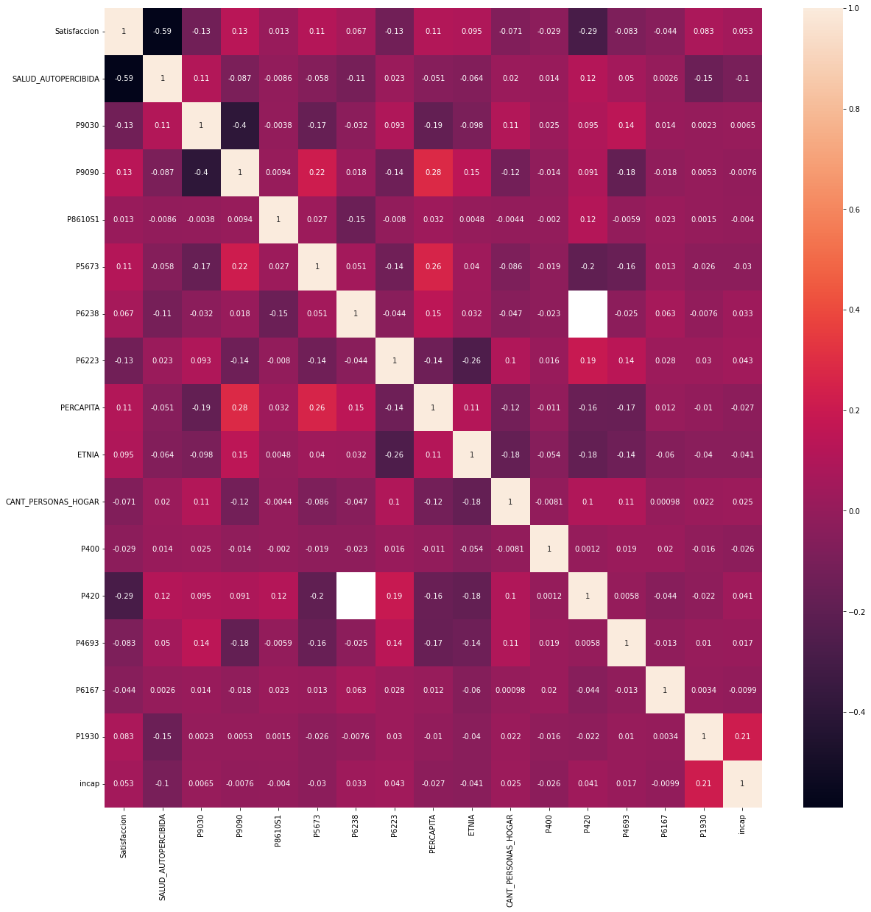
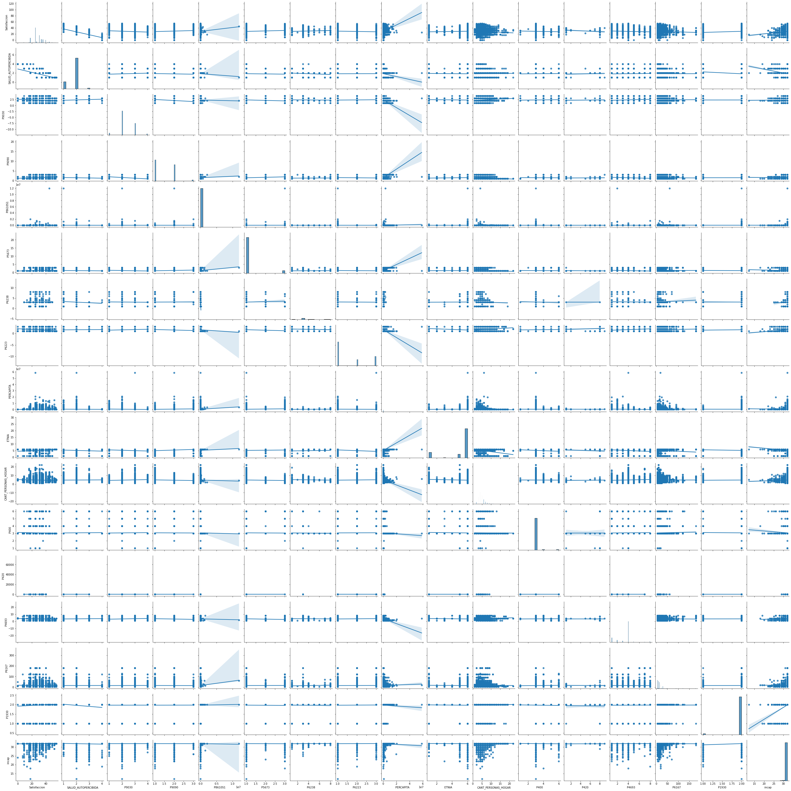

```python
!pip install networkx
```

    Requirement already satisfied: networkx in /opt/conda/lib/python3.9/site-packages (2.6.3)


```python
import pandas as pd
import numpy as np
import matplotlib.pyplot as plt
import seaborn as sns
from networkx import *
```

##Lectura de la base de datos **Características y composición del hogar**


```python
car_hogar = pd.read_csv('daten/Características y composición del hogar.csv', sep=';')
```


```python
#Reemplazar espacios por null
car_hogar = car_hogar.replace(' ',np.nan)
```


```python
# Clasificar los ninos entre 6 y 12 anos
car_hogar['Clasificación'] = car_hogar['P6040'].apply(lambda edad: 'nino' if edad <= 12 and edad > 5  else 'otro')
```


```python
car_hogar['ID_Persona'] = (car_hogar['DIRECTORIO'].astype(str) + car_hogar['SECUENCIA_ENCUESTA'].astype(str) + car_hogar['SECUENCIA_P'].astype(str).replace('.','')).astype(int)
```


```python
car_hogar['ID_Hogar'] = car_hogar['DIRECTORIO'].astype(str) + '-' + car_hogar['SECUENCIA_P'].astype(str)
```


```python
car_hogar_aux = car_hogar[car_hogar['SECUENCIA_ENCUESTA']>=0]
car = car_hogar_aux.groupby("Clasificación").count()
```

Sacamos los otros (que no son ninos)


```python
indx_otro = car_hogar[car_hogar['Clasificación']=='otro'].index
car_hogar=car_hogar.drop(indx_otro)
```


```python
car_hogar = car_hogar[['ID_Hogar', 'ID_Persona', 'P6040', 'P6080', 'P6081', 'P6083'] ]
```

### Lectura de la base de datos **Educación**


```python
educacion = pd.read_csv('daten/Educación.csv', sep=';')
educacion = educacion.replace(' ',np.nan)
# conbinacion escuela oficial con inoficial con y sin substito
educacion.update(educacion.P5674.replace('2', '3').replace('1', '2').rename('P5673'), overwrite=True)
# anadir 0 para el valor del baca para todos que no tienen beca.
educacion.update(educacion.P8610.replace('2', 1).rename('P8610S1'), overwrite=False)
```


```python
educacion['ID_Persona'] = (educacion['DIRECTORIO'].astype(str) + educacion['SECUENCIA_ENCUESTA'].astype(str) + educacion['SECUENCIA_P'].astype(str).replace('.','')).astype(int)
educacion = educacion[['ID_Persona', 'P5673', 'P6223', 'P6238', 'P8586', 'P8610S1', 'P4693', 'P6167', 'P782', 'P3004S1', 'P3004S2', 'P3004S3', 'P3004S4', 'P3004S5', 'P3004S6', 'P3004S7', 'P3004S8']]
```

### Merge entre las bases de datos leídas


```python
_merge = car_hogar.merge(educacion, how='left', on='ID_Persona')
```


```python
# deja solo los preguntas con a lo menos 201 respuestas de ninos
npding = np.array(_merge.count())>200
infocolms = _merge.columns[npding].tolist()
_merge = _merge[infocolms]
_merge.columns
```


    Index(['ID_Hogar', 'ID_Persona', 'P6040', 'P6080', 'P6081', 'P6083', 'P5673',
           'P6223', 'P6238', 'P8586', 'P8610S1', 'P4693', 'P6167', 'P782',
           'P3004S1', 'P3004S2', 'P3004S3', 'P3004S4', 'P3004S5', 'P3004S6',
           'P3004S7', 'P3004S8'],
          dtype='object')


```python
# Crear la varible actividades que tiene el número de los diferente actividedas que hacen.
p3004 = _merge[['P3004S1', 'P3004S2', 'P3004S3', 'P3004S4', 'P3004S5', 'P3004S6', 'P3004S7']].astype(float)
_merge['Actividades'] = p3004.sum(axis=1, min_count=1)
_merge.update((_merge['P3004S8'].astype(float)%1).rename('Actividades'), overwrite=False)
```

Ninos de 6 a 12 anos: 32012. con Respuestas a Actividades: 30478

### Lectura de la base de datos Servicios del hogar


```python
hogar = pd.read_csv('daten/Servicios del hogar.csv', sep=';')
hogar = hogar.replace(' ',np.nan)
```


```python
hogar['ID_Hogar'] = hogar['DIRECTORIO'].astype(str) + "-" + hogar['SECUENCIA_P'].astype(str)
hogar = hogar[['ID_Hogar', 'PERCAPITA', 'CANT_PERSONAS_HOGAR']]
```


```python
df = _merge.merge(hogar, how='left', on='ID_Hogar')
```

### Lectura de la base de datos Salud


```python
salud = pd.read_csv('daten/Salud.csv', sep=';')
salud = salud.replace(' ',np.nan)
salud['P6090'].replace(9, np.nan, inplace=True )
```


```python
salud['ID_Persona'] = (salud['DIRECTORIO'].astype(str) + salud['SECUENCIA_ENCUESTA'].astype(str) + salud['SECUENCIA_P'].astype(str)).astype(int)
# Crear la variable incap - la suma de las gravedades de las incapacidades (8 - incapacido; 32 - no tiene incapacidades)
salud['incap'] = salud[['P1906S1', 'P1906S2', 'P1906S3', 'P1906S4', 'P1906S5', 'P1906S6', 'P1906S7', 'P1906S8']].sum(axis=1, min_count=8)
salud = salud[['ID_Persona', 'P6090', 'P6127', 'P1930', 'incap']]
```


    ---------------------------------------------------------------------------

    KeyError                                  Traceback (most recent call last)

    /opt/conda/lib/python3.9/site-packages/pandas/core/indexes/base.py in get_loc(self, key, method, tolerance)
       3360             try:
    -> 3361                 return self._engine.get_loc(casted_key)
       3362             except KeyError as err:


    /opt/conda/lib/python3.9/site-packages/pandas/_libs/index.pyx in pandas._libs.index.IndexEngine.get_loc()


    /opt/conda/lib/python3.9/site-packages/pandas/_libs/index.pyx in pandas._libs.index.IndexEngine.get_loc()


    pandas/_libs/hashtable_class_helper.pxi in pandas._libs.hashtable.PyObjectHashTable.get_item()


    pandas/_libs/hashtable_class_helper.pxi in pandas._libs.hashtable.PyObjectHashTable.get_item()


    KeyError: 'DIRECTORIO'

    
    The above exception was the direct cause of the following exception:


    KeyError                                  Traceback (most recent call last)

    /tmp/ipykernel_58/2677195698.py in <module>
    ----> 1 salud['ID_Persona'] = (salud['DIRECTORIO'].astype(str) + salud['SECUENCIA_ENCUESTA'].astype(str) + salud['SECUENCIA_P'].astype(str)).astype(int)
          2 # Crear la variable incap - la suma de las gravedades de las incapacidades (8 - incapacido; 32 - no tiene incapacidades)
          3 salud['incap'] = salud[['P1906S1', 'P1906S2', 'P1906S3', 'P1906S4', 'P1906S5', 'P1906S6', 'P1906S7', 'P1906S8']].sum(axis=1, min_count=8)
          4 salud = salud[['ID_Persona', 'P6090', 'P6127', 'P1930', 'incap']]


    /opt/conda/lib/python3.9/site-packages/pandas/core/frame.py in __getitem__(self, key)
       3456             if self.columns.nlevels > 1:
       3457                 return self._getitem_multilevel(key)
    -> 3458             indexer = self.columns.get_loc(key)
       3459             if is_integer(indexer):
       3460                 indexer = [indexer]


    /opt/conda/lib/python3.9/site-packages/pandas/core/indexes/base.py in get_loc(self, key, method, tolerance)
       3361                 return self._engine.get_loc(casted_key)
       3362             except KeyError as err:
    -> 3363                 raise KeyError(key) from err
       3364 
       3365         if is_scalar(key) and isna(key) and not self.hasnans:


    KeyError: 'DIRECTORIO'


```python
df = df.merge(salud, how='left', on='ID_Persona')
```

### Lectura de la base de datos Trabajo infantil


```python
trabajo = pd.read_csv('daten/Trabajo infantil.csv', sep=';')
trabajo = trabajo.replace(' ',np.nan)
```

    /opt/conda/lib/python3.9/site-packages/IPython/core/interactiveshell.py:3457: DtypeWarning: Columns (5) have mixed types.Specify dtype option on import or set low_memory=False.
      exec(code_obj, self.user_global_ns, self.user_ns)


```python
trabajo['ID_Persona'] = (trabajo['DIRECTORIO'].astype(str) + trabajo['SECUENCIA_ENCUESTA'].astype(str) + trabajo['SECUENCIA_P'].astype(str)).astype(int)
trabajo = trabajo[['ID_Persona', 'P171', 'P400', 'P401', 'P402', 'P403', 'P420', 'P404']]
```


```python
df = df.merge(trabajo, how='left', on='ID_Persona')
```

### Lectura de la base de datos Condiciones de vida del hogar y tenencia de bienes


```python
cond_hogar = pd.read_csv('daten/Condiciones de vida del hogar y tenencia de bienes.csv', sep=';')
```

    /opt/conda/lib/python3.9/site-packages/IPython/core/interactiveshell.py:3457: DtypeWarning: Columns (29) have mixed types.Specify dtype option on import or set low_memory=False.
      exec(code_obj, self.user_global_ns, self.user_ns)


```python
cond_hogar = cond_hogar.replace(' ',np.nan)
cond_hogar['ID_Hogar'] = cond_hogar['DIRECTORIO'].astype(str) + "-" + cond_hogar['SECUENCIA_P'].astype(str)
cond_hogar = cond_hogar[['ID_Hogar', 'P9090', 'P9030']]
```


```python
df = df.merge(cond_hogar, how='left', on='ID_Hogar')
```


```python
#Anadir zero horas trabajando por los que no trabajan
no_trabaja = ((df['P400'].astype(float)>1) * (df['P401'].astype(float)!=1) * (df['P402'].astype(float)!=1) * (df['P403'].astype(float)!=1))
df.update((no_trabaja.replace(False, np.nan)%1).rename('P171'), overwrite=False)

```


```python
df1 = df['P400'].astype(str).str.get_dummies()
df1.loc[df1.nan==1, '1.0'] = np.nan

df.P401.replace('2', 0, inplace=True)
df.P402.replace('2', 0, inplace=True)
df.P403.replace('2', 0, inplace=True)
df['trabaja'] = df1['1.0'] + df['P401'].replace(np.nan, 0).astype(int) + df['P402'].replace(np.nan, 0).astype(int) + df['P403'].replace(np.nan, 0).astype(int)
```


```python
df['Diferenzia_Edad_Amigos'] = (df['P782'].astype(float) - df['P6040']).map(lambda x: abs(x))
#df['Vive_Con_Padres'] = 

df.rename(columns={'P8586':'EDUCACION', 'P6127':'SALUD_AUTOPERCIBIDA', 'P6080':'ETNIA', 'P6040':'Edad',
                   'P171':'HORAS_TRABAJANDO'}, inplace=True)
```


```python
df['PERCAPITA'] = df['PERCAPITA'].astype(str).apply(lambda x: x.replace(',','.'))
```


```python
df.update(df['trabaja'].replace(1.0,np.nan).replace(0.0, '0').rename('P420'), overwrite=False)
```


```python
df['P420'].astype(str).str.get_dummies().sum()
```


    0      26501
    1         15
    2          2
    5          1
    6          2
    7          2
    8         25
    9          1
    nan     4750
    dtype: int64


```python
df['trabaja'].replace(1.0,np.nan).replace(0.0, '0').astype(str).str.get_dummies().sum()
```


    0      26501
    nan     4798
    dtype: int64


```python
df.columns
```


    Index(['ID_Hogar', 'ID_Persona', 'Edad', 'ETNIA', 'P6081', 'P6083', 'P5673',
           'P6223', 'P6238', 'EDUCACION', 'P8610S1', 'P4693', 'P6167', 'P782',
           'P3004S1', 'P3004S2', 'P3004S3', 'P3004S4', 'P3004S5', 'P3004S6',
           'P3004S7', 'P3004S8', 'Actividades', 'PERCAPITA', 'CANT_PERSONAS_HOGAR',
           'P6090', 'SALUD_AUTOPERCIBIDA', 'P1930', 'incap', 'HORAS_TRABAJANDO',
           'P400', 'P401', 'P402', 'P403', 'P420', 'P404', 'P9090', 'P9030',
           'trabaja', 'Diferenzia_Edad_Amigos', 'Actividades_p', 'Salud_p',
           'Satisfaccion'],
          dtype='object')


```python
df = df.astype({'EDUCACION':float, 'HORAS_TRABAJANDO':float, 'SALUD_AUTOPERCIBIDA':float, 'ETNIA':float, 'PERCAPITA':float})
```


    ---------------------------------------------------------------------------

    ValueError                                Traceback (most recent call last)

    /tmp/ipykernel_58/1073558309.py in <module>
    ----> 1 df = df.astype({'EDUCACION':float, 'HORAS_TRABAJANDO':float, 'SALUD_AUTOPERCIBIDA':float, 'ETNIA':float, 'PERCAPITA':float})
    

    /opt/conda/lib/python3.9/site-packages/pandas/core/generic.py in astype(self, dtype, copy, errors)
       5797                 if col_name in dtype:
       5798                     results.append(
    -> 5799                         col.astype(dtype=dtype[col_name], copy=copy, errors=errors)
       5800                     )
       5801                 else:


    /opt/conda/lib/python3.9/site-packages/pandas/core/generic.py in astype(self, dtype, copy, errors)
       5813         else:
       5814             # else, only a single dtype is given
    -> 5815             new_data = self._mgr.astype(dtype=dtype, copy=copy, errors=errors)
       5816             return self._constructor(new_data).__finalize__(self, method="astype")
       5817 


    /opt/conda/lib/python3.9/site-packages/pandas/core/internals/managers.py in astype(self, dtype, copy, errors)
        416 
        417     def astype(self: T, dtype, copy: bool = False, errors: str = "raise") -> T:
    --> 418         return self.apply("astype", dtype=dtype, copy=copy, errors=errors)
        419 
        420     def convert(


    /opt/conda/lib/python3.9/site-packages/pandas/core/internals/managers.py in apply(self, f, align_keys, ignore_failures, **kwargs)
        325                     applied = b.apply(f, **kwargs)
        326                 else:
    --> 327                     applied = getattr(b, f)(**kwargs)
        328             except (TypeError, NotImplementedError):
        329                 if not ignore_failures:


    /opt/conda/lib/python3.9/site-packages/pandas/core/internals/blocks.py in astype(self, dtype, copy, errors)
        589         values = self.values
        590 
    --> 591         new_values = astype_array_safe(values, dtype, copy=copy, errors=errors)
        592 
        593         new_values = maybe_coerce_values(new_values)


    /opt/conda/lib/python3.9/site-packages/pandas/core/dtypes/cast.py in astype_array_safe(values, dtype, copy, errors)
       1307 
       1308     try:
    -> 1309         new_values = astype_array(values, dtype, copy=copy)
       1310     except (ValueError, TypeError):
       1311         # e.g. astype_nansafe can fail on object-dtype of strings


    /opt/conda/lib/python3.9/site-packages/pandas/core/dtypes/cast.py in astype_array(values, dtype, copy)
       1255 
       1256     else:
    -> 1257         values = astype_nansafe(values, dtype, copy=copy)
       1258 
       1259     # in pandas we don't store numpy str dtypes, so convert to object


    /opt/conda/lib/python3.9/site-packages/pandas/core/dtypes/cast.py in astype_nansafe(arr, dtype, copy, skipna)
       1199     if copy or is_object_dtype(arr.dtype) or is_object_dtype(dtype):
       1200         # Explicit copy, or required since NumPy can't view from / to object.
    -> 1201         return arr.astype(dtype, copy=True)
       1202 
       1203     return arr.astype(dtype, copy=copy)


    ValueError: could not convert string to float: '265083,333333333'


### Calculo del variable de satisfacción:
Usamos los siguientes dos variable:
 - P6127 - Satisfacción de Salud (Salud)
 - P3004 - Número de las actividades realiza fuera de la jornada escolar (Educación)
Dicimos que el óptimo es participar en todas las actividades y tener un estado de salud "muy bueno".
Asimismo dicimos que el caso más peor es ninguna actividad y salud "malo".

Primero poderamos la variable "Actividades", así que la diverencia de 6 o 7 actividades no es tan grande que la diverencia de 1 o ninguna actividad con la formula de Gauß.


```python
lfunc = np.vectorize(lambda n: n*8 -((n+1)*n/2))
df['Actividades_p'] = lfunc(df['Actividades'])
```

Ahora queremos sumar los dos variables. Por eso relacionamos los valors de salud a lo mismo tamano.


```python
lfunc = np.vectorize(lambda n: n*(-9) + 36)
df['Salud_p'] = lfunc(df['SALUD_AUTOPERCIBIDA'])
```

Y los sumamos:


```python
df['Satisfaccion'] = df[['Salud_p', 'Actividades_p']].sum(axis=1, skipna=False).astype(float)
```


```python
# Se borran los datos que contengan NaN en satisfaccion, puesto que no podemos usar las para entrenar
df.drop(df[df.Satisfaccion.isna()].index, inplace=True)
```


```python
df.columns
```


    Index(['ID_Hogar', 'ID_Persona', 'Edad', 'ETNIA', 'P6081', 'P6083', 'P5673',
           'P6223', 'P6238', 'EDUCACION', 'P8610S1', 'P4693', 'P6167', 'P782',
           'P3004S1', 'P3004S2', 'P3004S3', 'P3004S4', 'P3004S5', 'P3004S6',
           'P3004S7', 'P3004S8', 'Actividades', 'PERCAPITA', 'CANT_PERSONAS_HOGAR',
           'P6090', 'SALUD_AUTOPERCIBIDA', 'P1930', 'incap', 'P9090', 'P9030',
           'HORAS_TRABAJANDO', 'P400', 'P401', 'P402', 'P403', 'P420', 'P404',
           'trabaja', 'Diferenzia_Edad_Amigos', 'Actividades_p', 'Salud_p',
           'Satisfaccion'],
          dtype='object')


```python
df.P8610S1.astype(str).str.get_dummies().sum()
```


    1           31152
    10000           1
    100000          3
    110000          1
    1115000         1
    120000          2
    1200000         1
    12000000        1
    134000          1
    140000          1
    145000          4
    15000           1
    150000          1
    1500000         1
    160000          1
    162000          1
    165000          1
    170000          2
    180000          3
    20000           4
    200000          1
    2000000         1
    25000           8
    250000          1
    30000          21
    35000           6
    37000           2
    38000           1
    380000          1
    39000           1
    40000           9
    45000           5
    50000          20
    560000          1
    60000          13
    65000           3
    68000           1
    70000           1
    700000          1
    75000           4
    80000           4
    800000          1
    87000           1
    90000           3
    96000           1
    99              5
    dtype: int64


## Mostrar correlaciones


```python
df_vars = df[['Satisfaccion', 'SALUD_AUTOPERCIBIDA', 'P9030', 'P9090', 'P8610S1', 'P5673', 'P6238', 'P6223', 'PERCAPITA', 'ETNIA', 'CANT_PERSONAS_HOGAR', 'P400', 'P420', 'P4693', 'P6167' , 'P1930', 'incap']].astype(float)
df_corr = df_vars.corr()
df_corr
```


<div>
<style scoped>
    .dataframe tbody tr th:only-of-type {
        vertical-align: middle;
    }

    .dataframe tbody tr th {
        vertical-align: top;
    }

    .dataframe thead th {
        text-align: right;
    }
</style>
<table border="1" class="dataframe">
  <thead>
    <tr style="text-align: right;">
      <th></th>
      <th>Satisfaccion</th>
      <th>SALUD_AUTOPERCIBIDA</th>
      <th>P9030</th>
      <th>P9090</th>
      <th>P8610S1</th>
      <th>P5673</th>
      <th>P6238</th>
      <th>P6223</th>
      <th>PERCAPITA</th>
      <th>ETNIA</th>
      <th>CANT_PERSONAS_HOGAR</th>
      <th>P400</th>
      <th>P420</th>
      <th>P4693</th>
      <th>P6167</th>
      <th>P1930</th>
      <th>incap</th>
    </tr>
  </thead>
  <tbody>
    <tr>
      <th>Satisfaccion</th>
      <td>1.000000</td>
      <td>-0.590376</td>
      <td>-0.125947</td>
      <td>0.133371</td>
      <td>0.012904</td>
      <td>0.113721</td>
      <td>0.067439</td>
      <td>-0.128320</td>
      <td>0.106891</td>
      <td>0.095033</td>
      <td>-0.071066</td>
      <td>-0.029005</td>
      <td>-0.288802</td>
      <td>-0.082573</td>
      <td>-0.044358</td>
      <td>0.083471</td>
      <td>0.052805</td>
    </tr>
    <tr>
      <th>SALUD_AUTOPERCIBIDA</th>
      <td>-0.590376</td>
      <td>1.000000</td>
      <td>0.107567</td>
      <td>-0.087442</td>
      <td>-0.008629</td>
      <td>-0.057992</td>
      <td>-0.108287</td>
      <td>0.023207</td>
      <td>-0.051138</td>
      <td>-0.063701</td>
      <td>0.019881</td>
      <td>0.014208</td>
      <td>0.115015</td>
      <td>0.050367</td>
      <td>0.002550</td>
      <td>-0.152961</td>
      <td>-0.103084</td>
    </tr>
    <tr>
      <th>P9030</th>
      <td>-0.125947</td>
      <td>0.107567</td>
      <td>1.000000</td>
      <td>-0.395149</td>
      <td>-0.003773</td>
      <td>-0.170949</td>
      <td>-0.031533</td>
      <td>0.093110</td>
      <td>-0.185826</td>
      <td>-0.098171</td>
      <td>0.106167</td>
      <td>0.024505</td>
      <td>0.094572</td>
      <td>0.144829</td>
      <td>0.014427</td>
      <td>0.002264</td>
      <td>0.006535</td>
    </tr>
    <tr>
      <th>P9090</th>
      <td>0.133371</td>
      <td>-0.087442</td>
      <td>-0.395149</td>
      <td>1.000000</td>
      <td>0.009444</td>
      <td>0.216280</td>
      <td>0.017945</td>
      <td>-0.141383</td>
      <td>0.279562</td>
      <td>0.147911</td>
      <td>-0.119945</td>
      <td>-0.013882</td>
      <td>0.090969</td>
      <td>-0.181675</td>
      <td>-0.018490</td>
      <td>0.005328</td>
      <td>-0.007551</td>
    </tr>
    <tr>
      <th>P8610S1</th>
      <td>0.012904</td>
      <td>-0.008629</td>
      <td>-0.003773</td>
      <td>0.009444</td>
      <td>1.000000</td>
      <td>0.026836</td>
      <td>-0.149750</td>
      <td>-0.008001</td>
      <td>0.031618</td>
      <td>0.004775</td>
      <td>-0.004370</td>
      <td>-0.002043</td>
      <td>0.117521</td>
      <td>-0.005935</td>
      <td>0.023057</td>
      <td>0.001454</td>
      <td>-0.003963</td>
    </tr>
    <tr>
      <th>P5673</th>
      <td>0.113721</td>
      <td>-0.057992</td>
      <td>-0.170949</td>
      <td>0.216280</td>
      <td>0.026836</td>
      <td>1.000000</td>
      <td>0.051252</td>
      <td>-0.135487</td>
      <td>0.257210</td>
      <td>0.040216</td>
      <td>-0.086174</td>
      <td>-0.019014</td>
      <td>-0.198375</td>
      <td>-0.162933</td>
      <td>0.012793</td>
      <td>-0.025631</td>
      <td>-0.029643</td>
    </tr>
    <tr>
      <th>P6238</th>
      <td>0.067439</td>
      <td>-0.108287</td>
      <td>-0.031533</td>
      <td>0.017945</td>
      <td>-0.149750</td>
      <td>0.051252</td>
      <td>1.000000</td>
      <td>-0.043664</td>
      <td>0.147927</td>
      <td>0.032294</td>
      <td>-0.046640</td>
      <td>-0.023196</td>
      <td>NaN</td>
      <td>-0.025351</td>
      <td>0.063125</td>
      <td>-0.007644</td>
      <td>0.032641</td>
    </tr>
    <tr>
      <th>P6223</th>
      <td>-0.128320</td>
      <td>0.023207</td>
      <td>0.093110</td>
      <td>-0.141383</td>
      <td>-0.008001</td>
      <td>-0.135487</td>
      <td>-0.043664</td>
      <td>1.000000</td>
      <td>-0.141605</td>
      <td>-0.262383</td>
      <td>0.103453</td>
      <td>0.016007</td>
      <td>0.190063</td>
      <td>0.141841</td>
      <td>0.027591</td>
      <td>0.029880</td>
      <td>0.043454</td>
    </tr>
    <tr>
      <th>PERCAPITA</th>
      <td>0.106891</td>
      <td>-0.051138</td>
      <td>-0.185826</td>
      <td>0.279562</td>
      <td>0.031618</td>
      <td>0.257210</td>
      <td>0.147927</td>
      <td>-0.141605</td>
      <td>1.000000</td>
      <td>0.112660</td>
      <td>-0.119068</td>
      <td>-0.010847</td>
      <td>-0.158106</td>
      <td>-0.167165</td>
      <td>0.012136</td>
      <td>-0.010113</td>
      <td>-0.026726</td>
    </tr>
    <tr>
      <th>ETNIA</th>
      <td>0.095033</td>
      <td>-0.063701</td>
      <td>-0.098171</td>
      <td>0.147911</td>
      <td>0.004775</td>
      <td>0.040216</td>
      <td>0.032294</td>
      <td>-0.262383</td>
      <td>0.112660</td>
      <td>1.000000</td>
      <td>-0.176521</td>
      <td>-0.053936</td>
      <td>-0.182640</td>
      <td>-0.137214</td>
      <td>-0.059510</td>
      <td>-0.040189</td>
      <td>-0.041035</td>
    </tr>
    <tr>
      <th>CANT_PERSONAS_HOGAR</th>
      <td>-0.071066</td>
      <td>0.019881</td>
      <td>0.106167</td>
      <td>-0.119945</td>
      <td>-0.004370</td>
      <td>-0.086174</td>
      <td>-0.046640</td>
      <td>0.103453</td>
      <td>-0.119068</td>
      <td>-0.176521</td>
      <td>1.000000</td>
      <td>-0.008084</td>
      <td>0.101671</td>
      <td>0.105307</td>
      <td>0.000979</td>
      <td>0.021784</td>
      <td>0.025161</td>
    </tr>
    <tr>
      <th>P400</th>
      <td>-0.029005</td>
      <td>0.014208</td>
      <td>0.024505</td>
      <td>-0.013882</td>
      <td>-0.002043</td>
      <td>-0.019014</td>
      <td>-0.023196</td>
      <td>0.016007</td>
      <td>-0.010847</td>
      <td>-0.053936</td>
      <td>-0.008084</td>
      <td>1.000000</td>
      <td>0.001244</td>
      <td>0.019469</td>
      <td>0.020239</td>
      <td>-0.016236</td>
      <td>-0.026407</td>
    </tr>
    <tr>
      <th>P420</th>
      <td>-0.288802</td>
      <td>0.115015</td>
      <td>0.094572</td>
      <td>0.090969</td>
      <td>0.117521</td>
      <td>-0.198375</td>
      <td>NaN</td>
      <td>0.190063</td>
      <td>-0.158106</td>
      <td>-0.182640</td>
      <td>0.101671</td>
      <td>0.001244</td>
      <td>1.000000</td>
      <td>0.005800</td>
      <td>-0.043752</td>
      <td>-0.021635</td>
      <td>0.040654</td>
    </tr>
    <tr>
      <th>P4693</th>
      <td>-0.082573</td>
      <td>0.050367</td>
      <td>0.144829</td>
      <td>-0.181675</td>
      <td>-0.005935</td>
      <td>-0.162933</td>
      <td>-0.025351</td>
      <td>0.141841</td>
      <td>-0.167165</td>
      <td>-0.137214</td>
      <td>0.105307</td>
      <td>0.019469</td>
      <td>0.005800</td>
      <td>1.000000</td>
      <td>-0.013104</td>
      <td>0.009972</td>
      <td>0.016844</td>
    </tr>
    <tr>
      <th>P6167</th>
      <td>-0.044358</td>
      <td>0.002550</td>
      <td>0.014427</td>
      <td>-0.018490</td>
      <td>0.023057</td>
      <td>0.012793</td>
      <td>0.063125</td>
      <td>0.027591</td>
      <td>0.012136</td>
      <td>-0.059510</td>
      <td>0.000979</td>
      <td>0.020239</td>
      <td>-0.043752</td>
      <td>-0.013104</td>
      <td>1.000000</td>
      <td>0.003412</td>
      <td>-0.009931</td>
    </tr>
    <tr>
      <th>P1930</th>
      <td>0.083471</td>
      <td>-0.152961</td>
      <td>0.002264</td>
      <td>0.005328</td>
      <td>0.001454</td>
      <td>-0.025631</td>
      <td>-0.007644</td>
      <td>0.029880</td>
      <td>-0.010113</td>
      <td>-0.040189</td>
      <td>0.021784</td>
      <td>-0.016236</td>
      <td>-0.021635</td>
      <td>0.009972</td>
      <td>0.003412</td>
      <td>1.000000</td>
      <td>0.211465</td>
    </tr>
    <tr>
      <th>incap</th>
      <td>0.052805</td>
      <td>-0.103084</td>
      <td>0.006535</td>
      <td>-0.007551</td>
      <td>-0.003963</td>
      <td>-0.029643</td>
      <td>0.032641</td>
      <td>0.043454</td>
      <td>-0.026726</td>
      <td>-0.041035</td>
      <td>0.025161</td>
      <td>-0.026407</td>
      <td>0.040654</td>
      <td>0.016844</td>
      <td>-0.009931</td>
      <td>0.211465</td>
      <td>1.000000</td>
    </tr>
  </tbody>
</table>
</div>


```python
plt.figure(figsize=(20,20))
sns.heatmap(df_corr, annot=True)
```


    <AxesSubplot:>





```python
sns.pairplot(df_vars, kind='reg')
plt.show()
```





#### Correlacion con Etnia


```python
df1 = df.ETNIA.astype('string').str.get_dummies()
df_corr = df1.corrwith(df['Satisfaccion'])
plt.figure(figsize=(20,20))
#sns.heatmap(df_corr, annot=True)
pd.DataFrame({'corr':df_corr,'sum':df1.sum()})
```


<div>
<style scoped>
    .dataframe tbody tr th:only-of-type {
        vertical-align: middle;
    }

    .dataframe tbody tr th {
        vertical-align: top;
    }

    .dataframe thead th {
        text-align: right;
    }
</style>
<table border="1" class="dataframe">
  <thead>
    <tr style="text-align: right;">
      <th></th>
      <th>corr</th>
      <th>sum</th>
    </tr>
  </thead>
  <tbody>
    <tr>
      <th>1.0</th>
      <td>-0.093002</td>
      <td>4472</td>
    </tr>
    <tr>
      <th>2.0</th>
      <td>-0.002130</td>
      <td>13</td>
    </tr>
    <tr>
      <th>3.0</th>
      <td>0.003875</td>
      <td>103</td>
    </tr>
    <tr>
      <th>4.0</th>
      <td>0.002908</td>
      <td>9</td>
    </tr>
    <tr>
      <th>5.0</th>
      <td>-0.013041</td>
      <td>2992</td>
    </tr>
    <tr>
      <th>6.0</th>
      <td>0.084470</td>
      <td>23184</td>
    </tr>
  </tbody>
</table>
</div>


    <Figure size 1440x1440 with 0 Axes>


Resultado: positivo es Otra(6), negativo Indígena(1)

#### Correlacion con P420 - Lugar de Trabajo


```python
df1 = df.P420.str.get_dummies()
df1 = df1.join(df[['trabaja', 'P401', 'P402', 'P403']])
df_corr = df1.astype(float).corrwith(df['Satisfaccion'])
plt.figure(figsize=(20,20))
pd.DataFrame({'corr':df_corr,'sum':df1.sum()})
```

    /tmp/ipykernel_263/483107948.py:5: FutureWarning: Dropping of nuisance columns in DataFrame reductions (with 'numeric_only=None') is deprecated; in a future version this will raise TypeError.  Select only valid columns before calling the reduction.
      pd.DataFrame({'corr':df_corr,'sum':df1.sum()})


<div>
<style scoped>
    .dataframe tbody tr th:only-of-type {
        vertical-align: middle;
    }

    .dataframe tbody tr th {
        vertical-align: top;
    }

    .dataframe thead th {
        text-align: right;
    }
</style>
<table border="1" class="dataframe">
  <thead>
    <tr style="text-align: right;">
      <th></th>
      <th>corr</th>
      <th>sum</th>
    </tr>
  </thead>
  <tbody>
    <tr>
      <th>1</th>
      <td>0.012458</td>
      <td>15.0</td>
    </tr>
    <tr>
      <th>2</th>
      <td>0.004664</td>
      <td>2.0</td>
    </tr>
    <tr>
      <th>5</th>
      <td>-0.005333</td>
      <td>1.0</td>
    </tr>
    <tr>
      <th>6</th>
      <td>0.002921</td>
      <td>2.0</td>
    </tr>
    <tr>
      <th>7</th>
      <td>0.005827</td>
      <td>2.0</td>
    </tr>
    <tr>
      <th>8</th>
      <td>-0.007269</td>
      <td>25.0</td>
    </tr>
    <tr>
      <th>9</th>
      <td>0.009464</td>
      <td>1.0</td>
    </tr>
    <tr>
      <th>P401</th>
      <td>0.001817</td>
      <td>NaN</td>
    </tr>
    <tr>
      <th>P402</th>
      <td>-0.003171</td>
      <td>NaN</td>
    </tr>
    <tr>
      <th>P403</th>
      <td>0.009503</td>
      <td>NaN</td>
    </tr>
    <tr>
      <th>trabaja</th>
      <td>0.005411</td>
      <td>48.0</td>
    </tr>
  </tbody>
</table>
</div>


    <Figure size 1440x1440 with 0 Axes>


Podemos ver que no hay muchos datos y por eso las correlaciones so pequenos: (1)Trabaja en la vivienda es positivo y (8)trabajar en el campo o área rural mar o río es negativo

#### Correlaciones con P4693 - Medio de transporte a la escuela


```python
df1 = df.P4693.str.get_dummies()
df_corr = df1.astype(float).corrwith(df['Satisfaccion'])
plt.figure(figsize=(20,20))
pd.DataFrame({'corr':df_corr,'sum':df1.sum()})
```


<div>
<style scoped>
    .dataframe tbody tr th:only-of-type {
        vertical-align: middle;
    }

    .dataframe tbody tr th {
        vertical-align: top;
    }

    .dataframe thead th {
        text-align: right;
    }
</style>
<table border="1" class="dataframe">
  <thead>
    <tr style="text-align: right;">
      <th></th>
      <th>corr</th>
      <th>sum</th>
    </tr>
  </thead>
  <tbody>
    <tr>
      <th>1</th>
      <td>0.066895</td>
      <td>3710</td>
    </tr>
    <tr>
      <th>2</th>
      <td>0.021865</td>
      <td>1861</td>
    </tr>
    <tr>
      <th>3</th>
      <td>0.003239</td>
      <td>1091</td>
    </tr>
    <tr>
      <th>4</th>
      <td>-0.020649</td>
      <td>16666</td>
    </tr>
    <tr>
      <th>5</th>
      <td>0.001190</td>
      <td>554</td>
    </tr>
    <tr>
      <th>6</th>
      <td>-0.011107</td>
      <td>105</td>
    </tr>
    <tr>
      <th>7</th>
      <td>-0.044547</td>
      <td>391</td>
    </tr>
    <tr>
      <th>8</th>
      <td>-0.018723</td>
      <td>658</td>
    </tr>
  </tbody>
</table>
</div>


    <Figure size 1440x1440 with 0 Axes>


#### Correlaciones con P6238 - de dónde Recibe substito


```python
df1 = df.P6238.str.get_dummies()
df_corr = df1.astype(float).corrwith(df['Satisfaccion'])
plt.figure(figsize=(20,20))
pd.DataFrame({'corr':df_corr,'sum':df1.sum()})
```


<div>
<style scoped>
    .dataframe tbody tr th:only-of-type {
        vertical-align: middle;
    }

    .dataframe tbody tr th {
        vertical-align: top;
    }

    .dataframe thead th {
        text-align: right;
    }
</style>
<table border="1" class="dataframe">
  <thead>
    <tr style="text-align: right;">
      <th></th>
      <th>corr</th>
      <th>sum</th>
    </tr>
  </thead>
  <tbody>
    <tr>
      <th>1</th>
      <td>-0.017883</td>
      <td>101</td>
    </tr>
    <tr>
      <th>2</th>
      <td>-0.002867</td>
      <td>1</td>
    </tr>
    <tr>
      <th>3</th>
      <td>0.030094</td>
      <td>946</td>
    </tr>
    <tr>
      <th>4</th>
      <td>-0.008609</td>
      <td>114</td>
    </tr>
    <tr>
      <th>5</th>
      <td>0.002203</td>
      <td>13</td>
    </tr>
    <tr>
      <th>6</th>
      <td>0.003102</td>
      <td>3</td>
    </tr>
    <tr>
      <th>7</th>
      <td>0.002918</td>
      <td>16</td>
    </tr>
    <tr>
      <th>8</th>
      <td>0.009913</td>
      <td>17</td>
    </tr>
  </tbody>
</table>
</div>


    <Figure size 1440x1440 with 0 Axes>


Resultado: Positivo para la satisfaccion es ir en "Vehículo particular"(1) y negativo "Lancha, planchón, canoa"(7) 


```python
## Groups of Satisfaccion:
for i in range(0,55,11):
    lfunc = np.vectorize(lambda n: n>=i and n<i+11)
    df_vars2.loc[lfunc(df_vars['Satisfaccion']), 'Satisfaccion'] = i
   
sns.pairplot(df_vars2.astype(float), kind='reg')
plt.show()
```

#### Porqué no existen correlaciones entre Satisfaccion y Educacion?


```python
df[['Satisfaccion', 'EDUCACION', 'P3004S7']].astype(float).groupby('EDUCACION').mean()
```


<div>
<style scoped>
    .dataframe tbody tr th:only-of-type {
        vertical-align: middle;
    }

    .dataframe tbody tr th {
        vertical-align: top;
    }

    .dataframe thead th {
        text-align: right;
    }
</style>
<table border="1" class="dataframe">
  <thead>
    <tr style="text-align: right;">
      <th></th>
      <th>Satisfaccion</th>
      <th>P3004S7</th>
    </tr>
    <tr>
      <th>EDUCACION</th>
      <th></th>
      <th></th>
    </tr>
  </thead>
  <tbody>
    <tr>
      <th>1.0</th>
      <td>28.487798</td>
      <td>1.0</td>
    </tr>
  </tbody>
</table>
</div>


-> Todos que respondieron a la pregunta sobre las actividades están en educacion.

### Almacenar los datos:


```python
df.to_csv('daten/datos_ninos.csv', sep=';')
```


